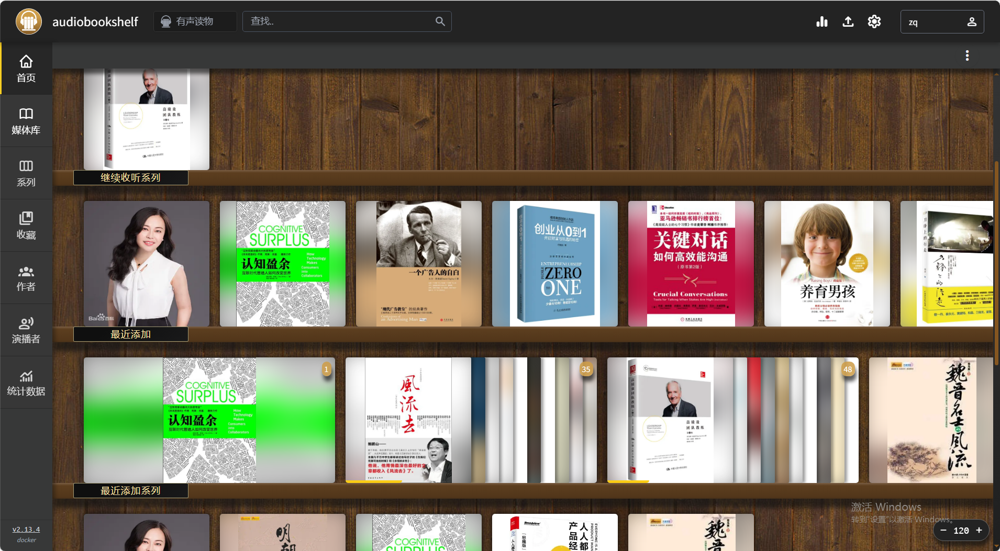
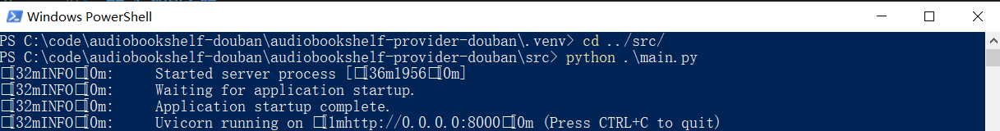
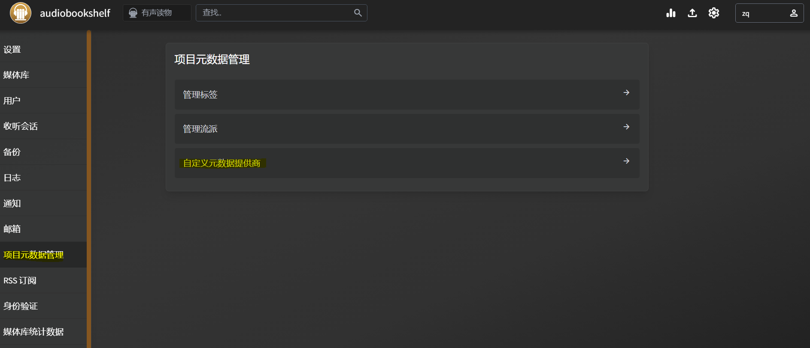
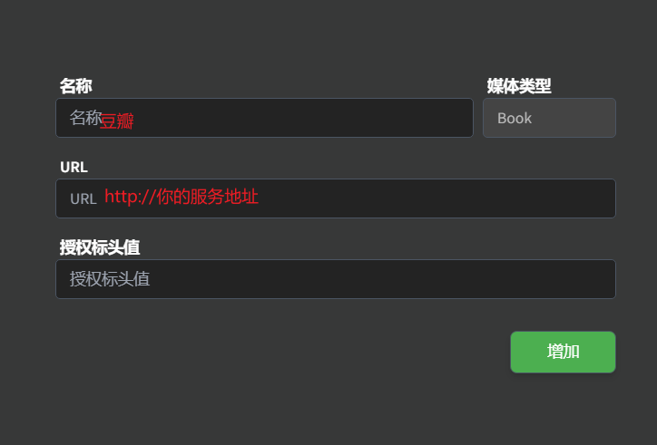

# audiobookshelf-provider-douban
# 项目名称
[audiobookshelf](https://www.audiobookshelf.org/) 图书刮削，豆瓣读书插件。

# 项目背景
Audiobookshelf是一个自托管自部署的有声读物服务器。

本人有听有声书的习惯，无奈这个应用给的刮削provider基本上无法刮削，或者刮削不完美，如：google book基础信息有，但是缺少封面。

audiobookshelf 2.8.0开始提供了自定义provider的功能，网上找了一圈没有找到现成的项目，于是就决定自己写一个。

# 方案
构造一个服务接口

    1.通过关键字请求[豆瓣读书](https://book.douban.com/)
    2.根据官方提供的provider接口构造返回数据

# 效果图


# 参考资料
**官网接口文档**:
audiobookshelf官方提供的provider定义的[openapi](https://github.com/advplyr/audiobookshelf/blob/master/custom-metadata-provider-specification.yaml):

**其他源码**
calibre-web-douban-api的插件[@fugary/calibre-web-douban-api](https://github.com/fugary/calibre-web-douban-api)

# 如何安装
## 1.源码安装
```
# 所需环境 python 3.9+
# 安装python依赖
pip install -r requirements.txt
# 运行程序 默认端口 8000
python main.py
```

## 2. 使用打包好的程序
```
# windows 为例
# 1、下载程序包
# 2、在当前页面打开`cmd`，进入`Scripts`目录，执行命令
./activate.bat
# 3、（仍在当前窗口下）进入`src`目录，执行命令
python main.py
# 4、保持窗口不要关闭,看到类似下面图片说明运行成功
```


## 3. 使用docker


# 如何使用
## audiobookshelf配置
`项目元数据`->`自定义元数据提供商`


服务器地址，如：http://192.168.8.1:8000

# 可能出现的问题
* 下载封面的时候blocked

解决方案：audiobookshelf 容器添加环境变量`DISABLE_SSRF_REQUEST_FILTER=1`
```ymal
# docker compose 示例
version: "3.7"
services:
  audiobookshelf:
    image: advplyr/audiobookshelf:latest
    ports:
      - 13378:80
    volumes:
      - ./audiobooks:/audiobooks
      - ./podcasts:/podcasts
      - ./config:/config
      - ./metadata:/metadata
    restart: always
    container_name: audiobookshelf
    environment:
      - TZ=Asia/Shanghai
      - DISABLE_SSRF_REQUEST_FILTER=1
```
参考:audiobookshelf[issuen#3255](https://github.com/advplyr/audiobookshelf/issues/3257)


## 规划
- [x] 使用python venv打包,方便携带使用
- [] 打包docker镜像推送至dockerhub


