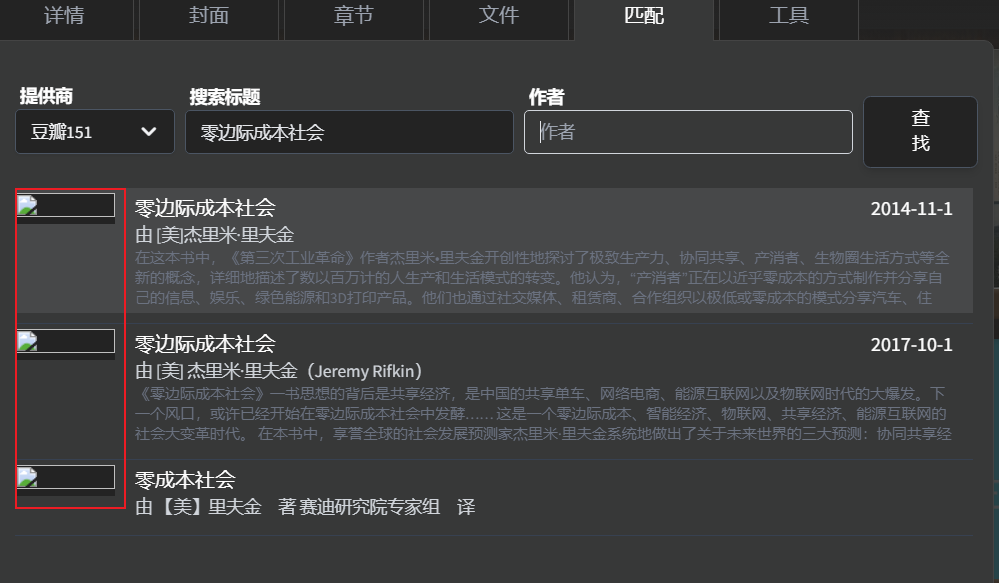

# audiobookshelf-provider-douban
# 项目名称
[audiobookshelf](https://www.audiobookshelf.org/) 图书刮削，豆瓣读书插件。

# 项目背景
Audiobookshelf是一个自托管自部署的有声读物服务器。

本人有听有声书的习惯，无奈这个应用给的刮削provider基本上无法刮削，或者刮削不完美，如：google book基础信息有，但是缺少封面。

audiobookshelf 2.8.0开始提供了自定义provider的功能，网上找了一圈没有找到现成的项目，于是就决定自己写一个。

# 方案
构造一个服务接口

    1.通过关键字请求[豆瓣读书](https://book.douban.com/)
    2.根据官方提供的provider接口构造返回数据

# 参考资料
**官网接口文档**:
audiobookshelf官方提供的provider定义的[openapi](https://github.com/advplyr/audiobookshelf/blob/master/custom-metadata-provider-specification.yaml):

**其他源码**
calibre-web-douban-api的插件[@fugary/calibre-web-douban-api](https://github.com/fugary/calibre-web-douban-api)

# 如何使用
## 1.程序安装
```
# 所需环境 python 3.9+
# 安装python依赖
pip install -r requirements.txt
# 运行程序 默认端口 8000
python main.py
```
## 2.audiobookshelf使用
`项目元数据`->`自定义元数据提供商`


服务器地址，如：http://192.168.8.1:8000

# 当前现状&后续规划
## 现状
1. 提供自动手工搜索、自动刮削
2. [问题]封面图搜索时预览时没有展示，保存时有用



## 规划
1. ~~使用python venv打包,方便携带使用~~
2. 打包docker镜像推送至dockerhub


